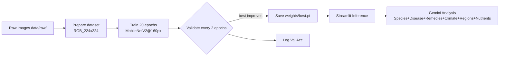

# Multi-Crop Plant Recognition – Project Report

This report explains the full project in a simple, easy-to-read format: what we built, technologies used, issues faced, how we fixed them, results, and what we will do next. It includes tables and a workflow diagram.

---

## 1) Executive Summary
- Goal: Fast and accurate plant species recognition (154 classes) with agronomy guidance.
- Outcome: Streamlit web app + Gemini integration. Predicts species, provides tips, disease analysis, remedies, climate/season, regions, characteristics, and nutrients.
- Speed: Epoch time reduced significantly via MobileNetV2, img size 160, fewer validations, and warm-start training.

---

## 2) Objectives
- Build end-to-end dataset → training → inference web app pipeline.
- Optimize for fast training on CPU/GPU-limited hardware.
- Add actionable guidance for farmers: treatments, home remedies, prevention, and climate information.
- Keep code modular and documented for maintenance.

---

## 3) Technology Stack
| Area | Choice | Why |
|---|---|---|
| Deep Learning | PyTorch + timm | Reliable, rich model zoo, easy training/inference |
| Model | MobileNetV2 (mobilenetv2_100) | Excellent speed/accuracy tradeoff for 154 classes |
| Data Augmentation | Albumentations | Fast, flexible transforms |
| Web UI | Streamlit | Rapid development and deployment |
| API/LLM | Google Gemini (google-generativeai) | Rich language output for agriculture insights |
| Config | YAML + OmegaConf | Clean, reproducible hyperparameters |

---

## 4) Workflow Diagram

---

## 5) Dataset & Preprocessing
- Source: `data/raw/` with 154 class folders (RGB images).
- Split strategy: Per-class stratified split into `train/val/test` via `src/data/prepare_dataset.py`.
- Normalization: ImageNet mean/std; image resized to `160x160` during training and inference.

---

## 6) Model & Training Setup
| Item | Setting | Rationale |
|---|---|---|
| Backbone | mobilenetv2_100 | Lightweight, fast, robust for 154 classes |
| Image size | 160 | Lower compute per batch |
| Epochs | 20 | Balanced speed and convergence |
| Batch size | 64 | Fewer iterations per epoch (with AMP + channels_last) |
| Optimizer | AdamW | Stable with weight decay |
| LR schedule | Cosine, warmup=3 | Smooth learning rate evolution |
| Regularization | Mixup/CutMix: OFF | Speed-focused profile |
| Validation cadence | val_every=2 | Reduces idle time on validation |
| Warm-start | freeze_backbone_epochs=3 | Train classifier head first, then unfreeze |

Key files: `configs/train.yaml`, `src/training/train.py`, `src/models/build.py`.

---

## 7) Issues Faced and Fixes
| Problem | Symptom/Trace | Root Cause | Fix |
|---|---|---|---|
| Streamlit import error | ModuleNotFoundError: src | App executed from project root not on path | Add project root to `sys.path` in `src/app/streamlit_app.py` |
| Inference top-k bug | TypeError: unhashable type: 'list' | `topk` tensors converted to nested lists | Flatten `topk` outputs before zipping in `src/models/infer.py` |
| Class mismatch | Assertion error: ncls != cfg.num_classes | New dataset had 154 classes | Update `configs/train.yaml` → `num_classes: 154` |
| Slow epochs | ~30 min/epoch initially | Heavy model/size and frequent validation | Switch to MobileNetV2, img=160, `val_every=2`, warm-start |
| Resume mismatch | Old checkpoints with different class count | Attempted to resume with older head | Clean `weights/` before starting new run |

---

## 8) Web App Features
- Upload or capture a plant image (camera).
- Displays Top‑5 species predictions and confidence.
- Dynamic, species-aware Tips (non-repetitive) from `src/app/tips_llm.py`.
- Gemini panel: Uses Google Gemini to output disease/status, treatments, home remedies, prevention, climate/season, regions, characteristics, and nutrients.
- Green-themed UI with animated background, wide layout, and two-column input area.

---

## 9) Gemini Integration
| Item | Detail |
|---|---|
| Library | `google-generativeai` |
| API key | Loaded from function arg → env (`GOOGLE_API_KEY`/`GEMINI_API_KEY`) → `secrets/gemini_api_key.txt` → Streamlit secrets |
| Prompt | Structured prompt guiding sections: species, diseases, treatments, prevention, climate/season, regions, characteristics, nutrients |
| Code | `src/services/gemini.py` → `analyze_plant_with_gemini(img, predicted_species, confidence, api_key)` |

Security note: avoid committing secrets. Prefer environment variables or `streamlit secrets` in production.

---

## 10) Results & Accuracy
- Checkpoints: `weights/best.pt` updated when validation improves; rolling `last_epochXXX.pt` for auto-resume.
- Validation accuracy: printed to terminal every `val_every` epochs and on the last epoch. Use these logs to track accuracy trend.
- Optional next step: add `eval.py` to compute Top‑1/Top‑5, per-class accuracy, and a confusion matrix on the test split.

---

## 11) Reproducibility – Commands
| Task | Command |
|---|---|
| Install deps | `pip install -r requirements.txt` |
| Prepare dataset | `python src/data/prepare_dataset.py --input data/raw --output data/RGB_224x224 --val_split 0.15 --test_split 0.15` |
| Train (full, fast) | `python -m src.training.train --config configs/train.yaml` |
| Quick experiment | `python -m src.training.train --config configs/train.yaml --epochs 10 --limit_train 100` |
| Run web app | `streamlit run src/app/streamlit_app.py` |

---

## 12) Achievements
- End-to-end system with 154-class recognition and actionable agronomy insights.
- Fast training mode with MobileNetV2 and smart scheduling.
- Stable web app with improved UI/UX and LLM assistance.
- Robustness improvements: import path fix, inference fix, config validation.

---

## 13) Future Work
- Add `eval.py` for detailed metrics and a dashboard in `reports/`.
- Early stopping, EMA model, and optional RandAugment for higher accuracy.
- Export to ONNX/TensorRT for lower-latency inference.
- Add Grad-CAM visualization in the app for explainability.
- Multi-lingual Gemini responses and offline tips fallback.

---

Generated on: 2025-09-17
